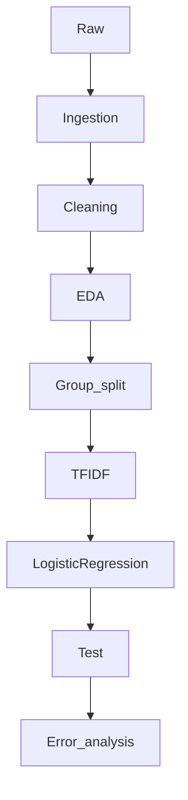

# F1

```mermaid
flowchart TD
Raw --> Ingestion
Ingestion --> Cleaning
Cleaning --> EDA
EDA --> Group_split
Group_split --> TFIDF
TFIDF --> LogisticRegression
LogisticRegression --> Test
Test --> Error_analysis
```

Каждая стрелка обозначает передачу данных либо результата операции. См. [экскурсию](../PROJECT_WALKTHROUGH.md).
